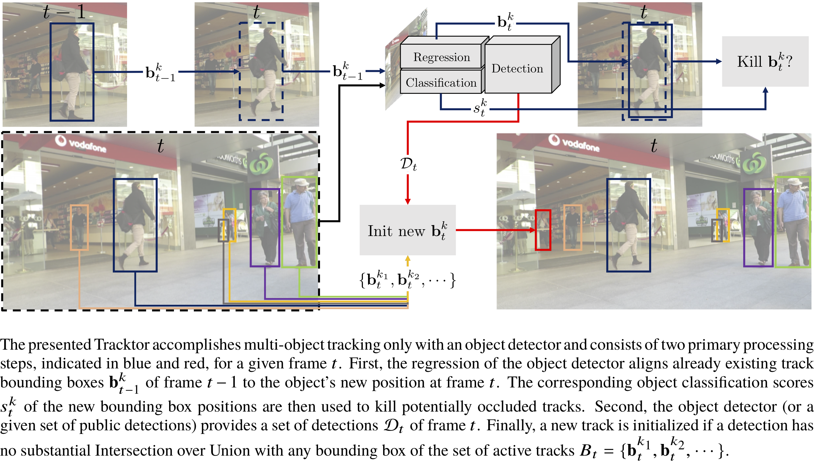

# Tracking without bells and whistles

This repository provides the implementation of our paper **Tracking without bells and whistles** (Philipp Bergmann, [Tim Meinhardt](https://dvl.in.tum.de/team/meinhardt/), [Laura Leal-Taixe](https://dvl.in.tum.de/team/lealtaixe/)) [https://arxiv.org/abs/1903.05625]. This branch includes an updated version of Tracktor for PyTorch 1.3 with an improved object detector. The original results of the paper were produced with the `iccv_19` branch.

In addition to our supplementary document, we provide an illustrative [web-video-collection](https://vision.in.tum.de/webshare/u/meinhard/tracking_wo_bnw-supp_video_collection.zip). The collection includes exemplary Tracktor++ tracking results and multiple video examples to accompany our analysis of state-of-the-art tracking methods.



## Installation

1. Clone and enter this repository:
    ```
    git clone https://github.com/phil-bergmann/tracking_wo_bnw
    cd tracking_wo_bnw
    ```

2. Install packages for Python 3.7 in [virtualenv](https://uoa-eresearch.github.io/eresearch-cookbook/recipe/2014/11/26/python-virtual-env/):
    1. `pip3 install -r requirements.txt`
    2. Install PyTorch 1.6 and torchvision 0.7 from [here](https://pytorch.org/get-started/previous-versions/#v160).
    3. Install Tracktor: `pip3 install -e .`

3. MOTChallenge data:
    1. Download [2DMOT2015](https://motchallenge.net/data/2DMOT2015.zip), [MOT16](https://motchallenge.net/data/MOT16.zip), [MOT17Det](https://motchallenge.net/data/MOT17Det.zip), [MOT17](https://motchallenge.net/data/MOT17.zip), [MOT20Det](https://motchallenge.net/data/MOT20Det.zip) and [MOT20](https://motchallenge.net/data/MOT20.zip) and place them in the `data` folder.
    2. Unzip all the data by executing:
        ```
        unzip -d 2DMOT2015 2DMOT2015.zip
        unzip -d MOT16 MOT16.zip
        unzip -d MOT17Det MOT17Det.zip
        unzip -d MOT17 MOT17.zip
        unzip -d MOT20Det MOT20Det.zip
        unzip -d MOT20 MOT20.zip
        ```
4. Download model (MOT17 object detector, MOT20 object detector, and re-identification network) and MOTChallenge result files:
    1. Download zip file from [here](https://vision.in.tum.de/webshare/u/meinhard/tracking_wo_bnw-output_v4.zip).
    2. Extract in `output` directory.

## Evaluate Tracktor
In order to configure, organize, log and reproduce our computational experiments, we structured our code with the [Sacred](http://sacred.readthedocs.io/en/latest/index.html) framework. For a detailed explanation of the Sacred interface please read its documentation.

1. Tracktor can be configured by changing the corresponding `experiments/cfgs/tracktor.yaml` config file. The default configuration runs Tracktor++ with the FPN object detector as described in the paper.

2. The default configuration is `Tracktor++`. Run `Tracktor++` by executing:

    ```
    python experiments/scripts/test_tracktor.py
    ```

3. The results are logged in the corresponding `output` directory.

For reproducibility, we provide the new result metrics of this updated code base on the `MOT17` challenge. It should be noted, that these surpass the original Tracktor results. This is due to the newly trained object detector. This version of Tracktor does not differ conceptually from the original ICCV 2019 version (see branch `iccv_19`). The results on the official MOTChallenge [webpage](https://motchallenge.net/results/MOT17/) are denoted as the `Tracktor++v2` tracker. The train and test results are:

```
********************* MOT17 TRAIN Results *********************
IDF1  IDP  IDR| Rcll  Prcn   GT  MT   PT   ML|    FP     FN   IDs    FM|  MOTA  MOTP MOTAL
65.2 83.8 53.3| 63.1  99.2 1638 550  714  374|  1732 124291   903  1258|  62.3  89.6  62.6

********************* MOT17 TEST Results *********************
IDF1  IDP  IDR| Rcll  Prcn   GT  MT   PT   ML|    FP     FN   IDs    FM|  MOTA  MOTP MOTAL
55.1 73.6 44.1| 58.3  97.4 2355 498 1026  831|  8866 235449  1987  3763|  56.3  78.8  56.7
```

We complement the results presented in the paper with `MOT20` train and test sequence results. To this end, we run the same tracking pipeline as for `MOT17` but apply an object detector model trained on the `MOT20` training sequences. The corresponding model file is the same as used for [this](https://github.com/dvl-tum/mot_neural_solver) work.

```
********************* MOT20 TRAIN Results *********************
IDF1  IDP  IDR| Rcll  Prcn   GT   MT   PT  ML|    FP     FN  IDs   FM| MOTA
60.7 73.4 51.7| 68.5  97.4 2212  892 1064 259| 20860 357227 2664 6504| 66.4

********************* MOT20 TEST Results *********************
IDF1  IDP  IDR| Rcll  Prcn   GT   MT   PT  ML|    FP     FN  IDs   FM| MOTA
52.6 73.7 41.0| 54.3  97.6 1242  365  546 331|  6930 236680 1648 4374| 52.6
```


## Train and test object detector (Faster R-CNN with FPN)

For the object detector, we followed the new native `torchvision` implementations of Faster R-CNN with FPN which are pre-trained on COCO. The provided object detection model was trained and tested with [this](https://colab.research.google.com/drive/1_arNo-81SnqfbdtAhb3TBSU5H0JXQ0_1) Google Colab notebook (or alternatively the `experiments/scripts/faster_rcnn_fpn_training.ipynb` Jupyter notebook). The object detection results on the `MOT17Det` train and test sets are:

```
********************* MOT17Det TRAIN Results ***********
Average Precision: 0.9090
Rcll  Prcn|  FAR     GT     TP     FP     FN| MODA  MODP
97.9  93.8| 0.81  66393  64989   4330   1404| 91.4  87.4

********************* MOT17Det TEST Results ***********
Average Precision: 0.8150
Rcll  Prcn|  FAR     GT     TP     FP     FN| MODA  MODP
86.5  88.3| 2.23 114564  99132  13184  15432| 75.0  78.3
```

## Training the re-identification model

1. The training config file is located at `experiments/cfgs/reid.yaml`.

2. Start training by executing `python experiments/scripts/train_reid.py`.

## Publication
 If you use this software in your research, please cite our publication:

```
  @InProceedings{tracktor_2019_ICCV,
  author = {Bergmann, Philipp and Meinhardt, Tim and Leal{-}Taix{\'{e}}, Laura},
  title = {Tracking Without Bells and Whistles},
  booktitle = {The IEEE International Conference on Computer Vision (ICCV)},
  month = {October},
  year = {2019}}
```
